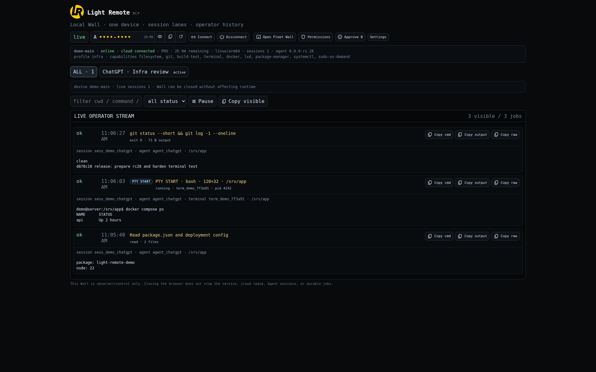
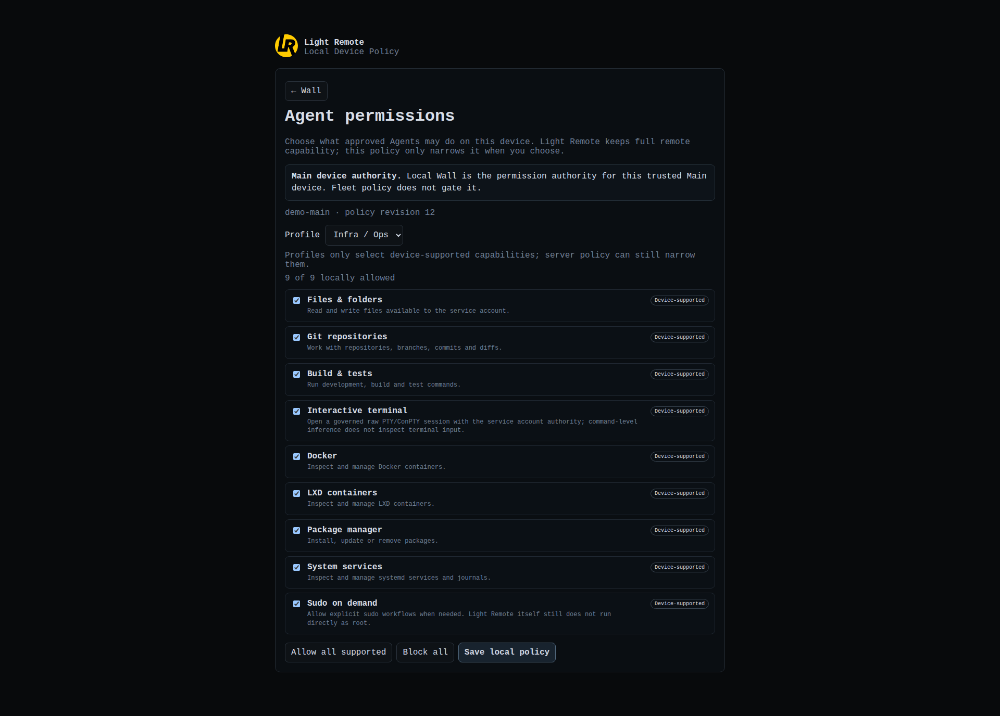

# Light Remote MCP

<p align="center">
  
</p>

<p align="center">
  <strong>Let ChatGPT Web and AI agents work on your machines over HTTP — without exposing inbound SSH on every target.</strong>
</p>

<p align="center">
  <a href="README.md">Tiếng Việt</a> · <a href="README.en.md"><b>English</b></a>
</p>

<p align="center">
  
  
  
  
  
</p>

**Light Remote MCP** is a governed remote-execution layer for ChatGPT Web, agents, and other AI models. Instead of giving an AI direct SSH access to every VPS or PC, Light Remote exposes filesystem, process, terminal PTY/ConPTY, Git, Docker, system services, and infrastructure operations through an HTTP path bound to an exact **device + session + Agent + policy**.

The practical goal is to replace much of the “open SSH and operate manually” workflow with an auditable AI connection that can be scoped per device, kept alive without an open terminal, and revoked.

> **Beta:** `0.9.0-rc.26` is a release candidate for testing. Start with low privileges on non-critical machines before enabling terminal, sudo/UAC, package-manager, or system-service permissions.
## Why Light Remote instead of a normal remote shell?

- **No inbound SSH requirement on leaf clients.** Windows/Linux/macOS agents maintain an outbound-first device channel to the Hub.
- **No terminal needs to stay open.** Windows runs a background Agent behind the tray app, Linux uses systemd, and macOS uses launchd.
- **Real PTY/ConPTY.** Agents can keep an interactive shell, send Ctrl-C, resize terminals, and run installers, TUIs, or curses applications.
- **Local Wall is the final local authority.** You can see sessions, jobs, command/output, PTY operations, A/B pairing, and choose `Safe / Developer / Infra / Full / Custom` permission profiles.
- **Fleet never silently jumps to another machine.** Every operation is bound to an exact target; offline or denied targets fail closed.
- **Signed updates with rollback.** Manifests are signed, artifacts are checked by SHA-256/size, and the independent Updater Helper health-checks a new Core before committing it.
- **Agents get a canonical tool contract.** Connection Helper handles pairing/context and Tool Helper tells the Agent when to use filesystem, search, process, PTY, exec, SCP, or durable jobs.

## Architecture at a glance

```text
ChatGPT Web / Agent / AI model
            |
            | HTTPS
            v
      Vercel bridge
            |
            v
   Light Remote Server / Hub
     session · policy · audit
            |
     +------+------+------+
     |             |      |
   Main         Windows  Linux/macOS
   Host          leaf      leaf
```

**Vercel is only a thin HTTP bridge.** The durable Hub remains on your Linux Server/VPS. Device clients connect outbound to the Hub; Vercel does not hold private device keys or the private update-signing key.
## What an Agent can do

| Area | Current capability |
| --- | --- |
| Filesystem | structured read/write/edit/stat/list/mkdir/copy/move/delete |
| Search | recursive file/content search with paging |
| Git / build | repositories, diffs, branches, build and test within policy |
| Exec | bounded one-shot shell/PowerShell/zsh with timeout and capability inference |
| Process | long-running stdin/stdout processes with incremental output and independent stop |
| Terminal | PTY on Linux/macOS, ConPTY on Windows; input/output/resize/Ctrl-C/terminate/kill |
| File transfer | SCP-style large/binary upload/download with per-chunk and whole-file SHA-256 checks |
| Infrastructure | Docker, LXD, systemd, Windows Services/Registry/Tasks/Firewall, macOS launchd/log where supported and allowed |
| Durable work | jobs can outlive one HTTP response; output can be fetched later |
| Multi-device | Fleet Wall, Main device, leaf routing, per-device policy and update orchestration when entitled |

### PTY/ConPTY when the Agent needs a real terminal

Light Remote does not fake terminal behavior through `exec`. `terminal-*` creates a real PTY/ConPTY, keeps ownership bound to account/device/session/Agent, and supports:

```text
start → input → output → resize → signal → list → stop
```

Because raw terminal input runs with the service-account authority and cannot be inferred command-by-command like `exec`, the `terminal` capability is **not included in Safe/Developer by default**. Enable it intentionally with `Infra`, `Full`, or `Custom` on the Wall.

## Device Wall — permissions and history stay on your side



Device Wall is the local control/observer surface for **one machine**. It shows cloud state, lease, session lanes, Agent, cwd, command/output, PTY operations, and the live operator stream. Closing the Wall does not stop the service, cloud lease, Agent session, or durable jobs.
### Local Device Policy



Policy is applied fail-closed:

```text
Main device = device-supported capabilities ∩ Local Wall policy
Fleet leaf  = device-supported capabilities ∩ server-approved policy ∩ Local Wall policy
```

Local Wall always keeps the **final deny**. `Infra` does not automatically mean sudo/UAC; elevated capabilities remain separately governed.

## Fleet Wall — many machines, still exact-target

When Fleet entitlement is enabled, one Main device can manage multiple leaf devices in the same account. Fleet provides device presence, Main-device authority, exact `deviceId/nodeId` routing, per-leaf policy/revocation, and signed client-update orchestration.

An offline, draining, or denied leaf never silently falls back to another machine. Fleet Wall itself is a **separately signed component**; Fleet, Core, and branding versions are not treated as one version plane.

## The three Helpers users and Agents will see

### 1. Connection Helper

Connection Helper turns pairing into a short A/B flow instead of asking users to handle long tokens:

1. Local Wall creates a short-lived **A code**.
2. ChatGPT/Agent submits A to `connection-helper` through Vercel.
3. The server returns a **B approval** bound to the exact Wall/device that created A.
4. The device owner reviews and approves B on that Wall.
5. The Agent polls again, receives `READY`, exact device/session context, and a private opaque client capability.

Opaque client/continuation values must remain private to the Agent runtime. Every additional device must be paired independently.
### 2. Tool Helper

Immediately after `READY`, the Agent loads Tool Helper. It describes the platform, shell modes, workspace, and canonical tool contract so the Agent can select the right mechanism:

- `fs` for structured file/text work;
- `search` for recursive discovery;
- `terminal-*` only when true PTY/ConPTY is needed;
- `process-*` for long-running non-TTY work;
- `exec` for bounded one-shot shell work;
- `scp` for large or binary files;
- `job/output` when work outlives one HTTP response.

Tool Helper also preserves exact `deviceId + sessionId + agentId` context to reduce accidental cross-device execution.

### 3. Updater Helper

Updater Helper is independent from Core. It verifies the signed manifest, artifact SHA-256/size, stages the new Core, performs a health check, and only then commits the update. If health fails, it can roll back instead of leaving the machine without a recovery path.

## Quick start for low-tech users

You need a GitHub account, a Vercel account, one Linux x64/arm64 VPS for the **Server/Hub**, an HTTPS domain/subdomain pointing to that Hub, at least one Windows/Linux/macOS client, and ChatGPT Web or another AI client that can call the HTTP bridge.

> The simplest starting layout is **Linux VPS as Hub + Vercel as bridge + Windows as client**.

### Step 1 — download the Beta from Releases

Open [GitHub Releases](https://github.com/n8n2erpnext/light-remote-mcp/releases) and choose the latest release candidate. For `v0.9.0-rc.26`, the main assets are the Linux Server x64/arm64 bundles, Windows full/compact installers, Linux `.deb` or tar client packages, macOS `.pkg` installers, the exact Vercel bridge bundle, and `SHA256SUMS.txt`.
### Step 2 — install the Linux Server / Hub

Extract the matching server bundle on the VPS. Example for arm64:

```bash
mkdir -p ~/light-remote && cd ~/light-remote
tar -xzf Light-Remote-MCP-Server-Linux-arm64-0.9.0-rc.26.tar.gz
cd package
```

The Hub requires Docker Compose v2. On Debian/Ubuntu, `--install-deps` can install supported prerequisites.

Create a public HTTPS URL such as `https://mcp.example.com` and reverse-proxy it to the Hub MCP listener. Use Caddy, Nginx, Cloudflare Tunnel, or another reverse proxy you already trust; Light Remote does not implicitly publish Wall to the Internet.

Install the Hub with a normal non-root executor user:

```bash
sudo ./install.sh \
  --user ubuntu \
  --vercel-team YOUR_VERCEL_TEAM_SLUG \
  --vercel-project light-remote-mcp \
  --public-mcp-url https://mcp.example.com \
  --install-deps
```

The installer prints **`Vercel OPERATOR_PUBLIC_KEYS_JSON value:`**. Copy that public JSON for the Vercel step. The private operator key stays on the Hub.
Defaults are:

```text
MCP listener  127.0.0.1:8080
Wall          127.0.0.1:8081
Server files  /opt/light-remote-mcp/server
Config        /etc/light-remote-mcp
State         /var/lib/light-remote-mcp
```

Keep a remote VPS Wall private. Either bind it to a private VPN address such as NetBird/Tailscale with the matching `--wall-url`, or keep localhost and use an SSH local forward only when you need owner approval.

### Step 3 — deploy the Vercel bridge

The lowest-friction path is to fork this repository and import the fork into Vercel:

1. Choose **Add New → Project** in Vercel.
2. Import your `light-remote-mcp` fork.
3. Keep Root Directory at the repository root.
4. Add these variables to both **Production** and **Preview**:

```text
VPS_MCP_BASE=https://mcp.example.com
VPS_MCP_URL=https://mcp.example.com/mcp
VPS_MCP_AUDIENCE=https://mcp.example.com
OPERATOR_PUBLIC_KEYS_JSON={public JSON printed by the Hub installer}
```

Deploy and keep the Vercel URL, for example `https://your-light-remote.vercel.app`. The Vercel team slug and project name must match the values given to the Server installer because the Hub verifies Vercel OIDC identity.
You can also deploy the exact `Light-Remote-MCP-Vercel-Bridge-0.9.0-rc.26.tar.gz` release bundle instead of forking the full repository. See [`deploy/vercel/README.md`](deploy/vercel/README.md).

### Step 4 — install a client

#### Windows x64 — easiest path

1. Download and run `Light-Remote-MCP-Setup-x64-0.9.0-rc.26.exe`.
2. Open Light Remote MCP.
3. Open **Server settings…** and enter:

```text
Vercel bridge URL: https://your-light-remote.vercel.app
Server / Hub URL:  https://mcp.example.com
```

4. Click **Enroll device**. The app creates a code and opens the approval page in your browser.
5. Sign in and approve the exact device shown.
6. When linked, switch **Connect** on if the app has not already connected.

You may close the main app window afterwards. The tray/background Agent remains alive; no PowerShell window needs to stay open.

#### Linux x64 / arm64

Download `install-linux-client.sh` and run:

```bash
chmod +x install-linux-client.sh
./install-linux-client.sh \
  --base-url https://your-light-remote.vercel.app \
  --hub-url https://mcp.example.com
```
Without `--bundle`, the Linux installer reads the signed Beta manifest, verifies its signature, selects x64/arm64, verifies SHA-256/size, and installs the package. If the device is not enrolled yet, the installer starts the approval flow during first install.

When installation finishes, the terminal can be closed: systemd keeps the Agent alive, signed update availability is checked periodically, and Local Wall defaults to `http://127.0.0.1:5491/`.

#### macOS Intel / Apple Silicon

Download the matching `.pkg` (`x86_64` or `arm64`), install it, then use the Light Remote menu bar flow: **Sign in / Link device… → Open Local Wall → Connect**.

Beta macOS packages may depend on external Apple signing/notarization credentials in the release pipeline. If macOS does not trust a package, verify its checksum and release provenance rather than disabling Gatekeeper for an unverified binary.

### Step 5 — connect ChatGPT Web to the exact machine

In a chat where your Vercel connector is available, open **Local Wall** on the exact machine you want the Agent to use, reveal/copy the **A code**, then send the capsule generated by Wall. It looks like:

```text
Light Remote connection request
A code: ABCD-EFGH
Agent: use @Vercel web_fetch_vercel_url directly. Do not search for a Vercel connector action named connection-helper; connection-helper is the Light Remote HTTP action inside the URL. First call payload {aCode,agentId,label}; encode it as base64url(JSON) in ?p= on https://lightremote.thaiduy.digital/api/operator?via=plus&action=connection-helper. Do not enumerate devices and do not send client on first pairing. Follow helper.nextAction; when helper.nextUrl is present, replay that URL exactly through @Vercel. Keep continuation/client private.
```

The Agent must follow Connection Helper responses rather than inventing protocol calls: A produces `approval_required` and B; approve B on the same Wall; the Agent replays `helper.nextUrl` exactly until `READY` (`helper.nextPayload` remains a private fallback contract); then it keeps the opaque client private and immediately loads Tool Helper.

From there you can ask naturally: “inspect this repo and fix the failing test”, “check Docker on the VPS”, “open a terminal for this TUI”, “copy this file to the Windows machine”, or “follow the build process”.

> Do not manually paste opaque client/continuation values into chat. They are short-lived internal capabilities for the Agent runtime.
### Step 6 — add another machine

Install/enroll/Connect Light Remote on the new machine, create a fresh **A code on that machine's Wall**, and perform an independent A/B pairing. There is no pre-auth fleet discovery: an Agent only sees devices the owner has explicitly authorized into that Agent client.

## Updates and Force Update

Clients use the signed Beta channel under `channels/beta/`. An update is accepted only when the manifest signature is valid, version policy rejects unsafe rollback/sidegrade, the HTTPS artifact matches SHA-256/size, and the new Core passes its health gate.

- Local Wall exposes **Check now / Update now** for independent-updater clients.
- Account/Fleet control can send **Force update** to an outdated client through an authenticated helper lane.
- Windows/Linux/macOS keep the updater independent from Core so a broken Core does not destroy the recovery path.
- Server/Hub uses a separate deployment plane; server Wall does not install a client package into the Host.

## Security model

Light Remote is not “HTTP as unrestricted root SSH”. Its main trust layers include Vercel OIDC, per-device Ed25519 identity, signed heartbeat/outbound traffic, one-time A/B pairing, session/job ownership, device-side capability inference, local final-deny policy, a separate terminal capability, signed updates, artifact integrity checks, and rollback.

Private device keys and the private update-signing key are not sent in client payloads or stored in Vercel/GitHub Actions. Read [`SECURITY.md`](SECURITY.md) before exposing a Hub/Wall or granting elevated capabilities.

## For developers and testers

Public `main` keeps the current code and release contracts clean. Pre-Beta handoffs/plans are frozen on [`before-beta`](https://github.com/n8n2erpnext/light-remote-mcp/tree/before-beta).
- Development/test guide: [`docs/DEVELOPMENT.md`](docs/DEVELOPMENT.md)
- Repository lanes: [`REPO_LANES.md`](REPO_LANES.md)
- Vercel bridge: [`deploy/vercel/README.md`](deploy/vercel/README.md)
- Host executor: [`operator-host/README.md`](operator-host/README.md)
- Signed Beta channel: [`channels/beta/README.md`](channels/beta/README.md)
- Release notes: [`docs/releases/`](docs/releases/)

Quick validation:

```bash
npm ci
npm test
# only on a real Linux host with the matching systemd/runtime environment
npm run test:host
```

## Beta status

`v0.9.0-rc.26` is the current Beta prerelease. Windows x64, Linux x64/arm64, macOS Intel/Apple Silicon, Linux Server, and the Vercel bridge have separate build lanes; the active signed client-update channel currently points to RC26.

Light Remote remains pre-stable software. Test with low privileges first, back up important data, and only enable terminal/sudo/UAC/system-service permissions when you understand the Agent's authority boundary.

## License

Apache-2.0. See [`LICENSE`](LICENSE), [`NOTICE`](NOTICE), and [`THIRD_PARTY_DISTRIBUTION_NOTICES.md`](THIRD_PARTY_DISTRIBUTION_NOTICES.md).
